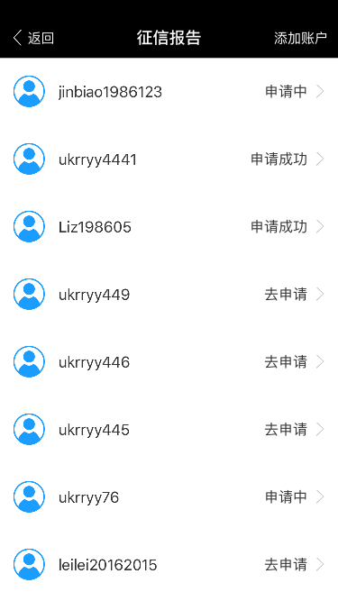

#CECreditReport SDK 接入指南

## 1. 集成准备
###  1.1. 联系开发申请商户号 `mechId` 和 p12文件
>无论以何种方式安装SDK，都需要联系开发拿到`商户ID`和`p12文件`及`p12密码`,添加`p12文件`到工程目录

### 1.2 安装SDK

### 使用 CocoaPods 安装SDK
Cocoapods是一个很好的依赖管理工具，推荐参考官方文档《[CocoaPods安装和使用教程](http://code4app.com/article/cocoapods-install-usage)》

Cocoapods 安装完成后，在你的项目根目录创建一个 Podfile 文件，添加如下内容：

	platform :ios, '7.0'
	xcodeproj 'MyApp/MyApp.xcodeproj'
	target 'MyApp' do
	  pod 'CECreditReport'
	end

在根目录下执行

	pod install

### 手动导入SDK
#### 下载压缩包，按照以下步骤将SDK导入到您的项目中。

* 解压 `CECreditReport-master` 压缩文件；
* 添加 `CECreditReport`文件夹下的 `CECreditReportManager.h` , `libCECreditReportSDK.a `,`Resource.bundle`添加到您的 `iOS 工程中`；

<b>提醒:</b>`记得勾选 "Copy items if needed"`

## 2. 添加编译参数

#### 在您的工程项目中添加编译参数

 
<b>1. </b> 找到 Linking 设置 
  在 Other Linker Flags 中添加 -all_load 参数，请注意大小写

  <b>2. </b>找到Info.list 文件添加
  
	    <key>NSAppTransportSecurity</key>
	    <dict>
	        <key>NSAllowsArbitraryLoads</key>
	        <true/>
	    </dict>

<b>提醒:</b> `Linking 设置位于 项目设置 target -> 选项卡 Build Settings，左上角选择 All。`

## 3.添加初始化函数
####在需要显示征信报告页调用API

	CECreditReportManager *creditReportManager = [CECreditReportManager sharedInstance];
    creditReportManager.rootViewController = self;
    creditReportManager.userId = @"xxxxxxxxxx";
    creditReportManager.merchId = @"xxxxxxxxx";
    
    //*** 必须生成私钥请查看RSA密码生成说明文件 ***//
    creditReportManager.p12Path = [[NSBundle mainBundle] pathForResource:@"private_key" ofType:@"p12"]
	creditReportManager.p12Password = @"xxxxxxx";
	
    //*** 可自定义导航栏背景色和导航栏title样式***//
    [CECreditReportManager sharedInstance].navigationBackgroundColor = [UIColor blueColor];
    [CECreditReportManager sharedInstance].navigationTitleAttributes = @{NSFontAttributeName:[UIFont systemFontOfSize:18],NSForegroundColorAttributeName:[UIColor colorWithRed:1 green:0 blue:0 alpha:0]};

    __weak typeof(self) weakSelf = self;
    creditReportManager.dismissBlock = ^(){
        __strong typeof(weakSelf) strongSelf = weakSelf;
      //*** 可选, 征信退出后,处理适配操作，比如导航栏、状态栏等. ***//
    };
    [creditReportManager startGetCRP];
    
   
## 参数说明

| 属性  | 是否必须  | 描述 |
|:-------------: |:---------------:| :-------------:|
| rootViewController     | 是 |     设置 rootViewController ，通过 present 方式来展现征信报告视图    |
| userId                 | 是 |           唯一标示 用户ID |
| merchId                | 是 |            商户ID |
| p12Path                | 是 |            私钥本地路径 |
| p12Password            | 是 |            私钥密码 |
| navigationBackgroundColor   | 否 |            设置导航栏背景色, 默认蓝色,如果设置为白色，需要更换Resource内 “nv_back” 图片资源 |
| navigationTitleAttributes   | 否 |            设置导航栏title 样式, 默认18字号 , 白色 |

## 演示项目
查看并运行`CECreditReportDemo/CECreditReportDemo.xcodeproj`
效果如下

    
## 系统要求
This SDK requires `iOS 7.0+` and `Xcode 7.0+`

## 许可证
使用 MIT 许可证，详情见 LICENSE 文件。

## 联系我
如有问题请联系我(haiqingxu@creditease.cn)
